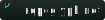
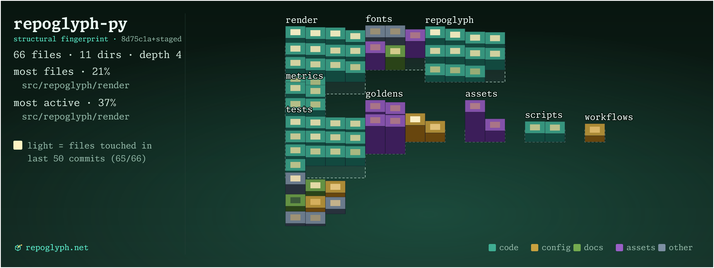

# repoglyph

[](https://repoglyph.net)
[](.glyph/okf/index.md)




Isometric repo-city banners from a local git clone. Each file is a building:
size drives height, type drives color, recent commits light windows. 


## Install

```bash
uv tool install "repoglyph[png]"   # standalone CLI on PATH
pip install "repoglyph[png]"       # CLI in the active environment
uv add --dev "repoglyph[png]"      # project dev dependency (CI, hooks)
```

Each installs the `repoglyph` command. Python 3.12+. Drop the `png` extra for
SVG-only output.

## Usage

```bash
repoglyph                 # current repo w/ defaults
repoglyph ../project
repoglyph . --style skyline --palette neon
```

Writes `<repo>/.glyph/<owner>_<repo>_<style>.svg`, plus a PNG with the `png` extra.

<details>
<summary><b>All flags</b></summary>

| Flag | Default | Meaning |
| --- | --- | --- |
| `--commits N` | `50` | commits used for lit windows |
| `--style NAME` | `oblique` | `oblique`, `skyline`, or `highrise` |
| `--palette NAME\|FILE` | `light` | built-in theme or palette JSON |
| `--size WxH` | `1280x480` | canvas size |
| `--full` | off | fit canvas to the whole city |
| `--out FILE` | auto | output SVG path |
| `--out-dir DIR` | `<repo>/.glyph` | folder for all outputs |
| `--no-png` | off | skip PNG output |
| `--skip-commons` | off | drop lockfiles from the city |
| `--staged` | off | draw HEAD + staged changes |
| `--okf [DIR]` | off | write an OKF context bundle |
| `--cache` | off | save repo data for `--from-cache` |

`repoglyph --help` for the rest.

</details>

<details>
<summary><b>Styles</b></summary>

- `oblique`: flat cabinet-oblique map (default)
- `skyline`: one building per file
- `highrise`: one tower per district, floors are subdirs

</details>

## OKF

`--okf` writes markdown context files from the same repo data: an index,
repository and hotspot summaries, and one file per district.

<details>
<summary><b>Limits</b></summary>

- Shows folder structure, not runtime architecture.
- Lit windows use the sampled commit window, not full history.
- File bytes proxy size.

</details>

## Contributing

See [CONTRIBUTING.md](CONTRIBUTING.md).

## License

Apache-2.0. Bundled Monaspace Xenon fonts are SIL OFL.
